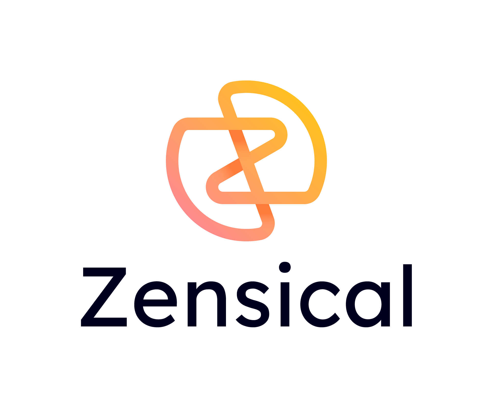

  <picture>
    <source media="(prefers-color-scheme: dark)" srcset=".github/assets/zensical-dark.png">
    <source media="(prefers-color-scheme: light)" srcset=".github/assets/zensical.png">
    
  </picture>

  <strong>
    A modern static site generator by the creators of
    <a href="https://github.com/squidfunk/mkdocs-material/">Material for MkDocs</a>
  </strong>

  
  

  <picture>
    <source media="(prefers-color-scheme: dark)" srcset=".github/assets/screenshot-dark.png">
    <source media="(prefers-color-scheme: light)" srcset=".github/assets/screenshot.png">
    
  </picture>

